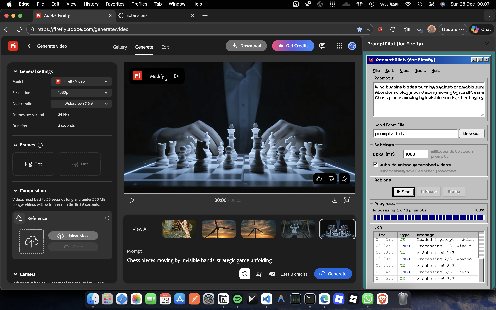

# PromptPilot (for Firefly)

<div align="center">
  
  <p><em>Chrome Extension for automating batch video generation in Adobe Firefly with auto-download feature.</em></p>
</div>

## 📸 Preview

<p align="center">
  
</p>

## 🎬 Features

- **Batch Processing**: Submit multiple prompts automatically
- **Auto-Download**: Automatically download videos after generation
- **Load from File**: Import prompts from TXT file (one prompt per line)
- **Delay Control**: Adjust delay between prompts (500-10000ms)
- **Progress Tracking**: Monitor progress with visual progress bar
- **Real-time Logs**: View generation status in real-time
- **Windows 95 UI**: Fun and nostalgic retro interface

## 📦 Installation

1. Clone or download this repository
2. Open Chrome and go to `chrome://extensions/`
3. Enable **Developer mode** (toggle in top right corner)
4. Click **Load unpacked**
5. Select this extension folder
6. Extension is ready to use!

## 🚀 How to Use

1. Open [Adobe Firefly](https://firefly.adobe.com/)
2. Click the extension icon in toolbar or sidebar
3. Enter prompts:
   - **Manual**: Type prompts directly (one per line)
   - **File**: Click "Browse..." to upload TXT file
4. Configure settings:
   - Delay between prompts
   - Toggle auto-download
5. Click **Start** to begin automation
6. Use **Pause** to temporarily stop
7. Use **Stop** to terminate the process

## 📝 TXT File Format

Create a TXT file with format:
```
A beautiful sunset over mountains
Abstract particle effects floating in space
Underwater scene with colorful coral reef
Cyberpunk city at night with neon lights
```

One prompt per line. Empty lines will be ignored.

## 📄 License

MIT License

## 🤝 Contributing

Contributions, issues, and feature requests are welcome!

---

Made with ❤️ for Adobe Firefly users
